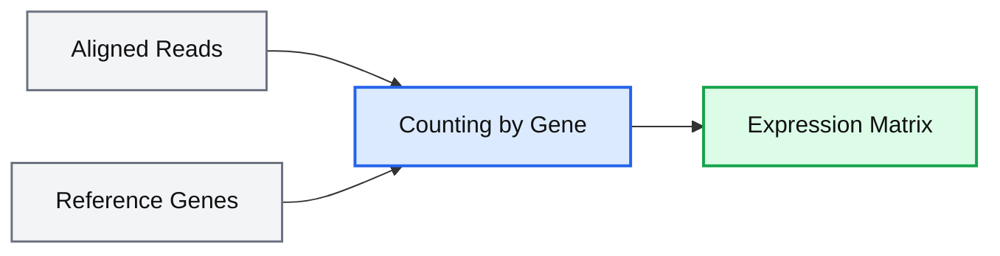

# Theory

# What is RNA-seq?

RNA-seq (RNA sequencing) is a technique used to quantify RNA molecules present in a biological sample.

In simplified terms, RNA extracted from cells is converted into a complementary DNA (cDNA) library, sequenced, and subsequently analyzed computationally.

The number of reads associated with a gene can be used as an estimate of its expression level.

<div align="center">

</div>

<p align="center">
<em>Figure 1. Overview of the RNA-seq workflow. (BioRender template)</em>
</p>

---

# Common Biological Questions

RNA-seq can be used to investigate:

- differentially expressed genes between conditions
- cellular responses to treatments
- differences between tissues or cell types
- regulatory programs and molecular pathways

---

# Experimental Design

Experimental design is one of the most important aspects of an RNA-seq experiment.

Even sophisticated computational analyses cannot compensate for poor experimental planning.

## Important Concepts

- biological replicates
- experimental controls
- batch effects
- sequencing depth
- randomization

## Example

| Good Experimental Design | Problematic Experimental Design |
|---|---|
| multiple biological replicates | only one sample per group |
| balanced batches | groups processed separately |
| appropriate controls | lack of controls |

<div align="center">

</div>

<p align="center">
<em>Figure 2. Confounding effects between technical variation and biology. Source: https://www.biorxiv.org/content/10.1101/025528v1</em>
</p>

---

# Overview of the RNA-seq Workflow

A typical RNA-seq experiment involves several computational steps.

## General Workflow

<div align="center">

</div>

<p align="center">
<em>Figure 3. Overview of a typical RNA-seq workflow.</em>
</p>

---

# Reads and FASTQ Files

Sequencing generates FASTQ files containing RNA reads.

Each read contains:

| Line | Description |
|---|---|
| 1 | Read identifier; always begins with @ |
| 2 | Read sequence |
| 3 | Always begins with + |
| 4 | Quality score for each nucleotide in the read |

## Example

```text
@HWI-ST330:304:H045HADXX:1:1101:1111:61397
CACTTGTAAGGGCAGGCCCCCTTCACCCTCCCGCTCCTGGGGGANNNNNNNNNNANNNCGAGGCCCTGGGGTAGAGGGNNNNNNNNNNNNNNGATCTTGG
+
@?@DDDDDDHHH?GH:?FCBGGB@C?DBEGIIIIAEF;FCGGI#########################################################
```

```text
 Quality code:  !"#$%&'()*+,-./0123456789:;<=>?@ABCDEFGHI
                |         |         |         |         |
 Quality score: 0........10........20........30........40   
```
---

# Quality Control

Before analysis, it is important to evaluate sequencing quality.

Common tools include:

- FastQC
- MultiQC

## Why is Quality Control Important?

Low-quality reads can:

- map incorrectly
- reduce alignment efficiency
- generate false positives
- increase experimental noise

<div align="center">

</div>

<p align="center">
<em>Figure 4. Example of FASTQ quality assessment.</em>
</p>

## Common Metrics

## Per-base Quality

One of the most important metrics is the average quality score across sequencing cycles.

In general:

- reads tend to lose quality toward their ends
- low-quality regions can be removed during trimming

## GC Content

Evaluates the distribution of GC content across reads.

Unexpected deviations may indicate:

- contamination
- library preparation bias
- unusual sample composition

## Adapter Sequences

During library preparation, adapters are added to nucleic acid fragments.

When very short fragments are sequenced, portions of these adapters may appear within reads.

This can:

- interfere with alignment
- affect quantification
- increase technical noise

Trimming tools remove these sequences before downstream analysis.

---

# Trimming and Filtering

After QC, reads may undergo:

- adapter removal
- low-quality base trimming
- filtering of short reads

Common tools include:

- Trim Galore
- fastp
- Cutadapt

---

# Alignment and Pseudoalignment

After quality control, reads must be assigned to reference genes or transcripts.

This step allows us to determine:

- which gene a read most likely originated from
- which genes are being expressed
- the relative abundance of each transcript

## Common Tools

| Strategy | Tools |
|---|---|
| Alignment | STAR, HISAT2 |
| Pseudoalignment | Salmon, Kallisto |

## Reference Genome

Represents the complete DNA sequence of an organism, including:

- chromosomes
- genes
- intergenic regions

## Transcriptome

Represents only the expected transcribed sequences, including:

- exons from expressed genes
- isoforms
- annotated transcripts

## Traditional Alignment

In traditional alignment, each read is mapped directly to the reference genome.

The algorithm attempts to determine:

- the exact read position
- mismatches
- gaps
- splice junctions

<div align="center">

</div>

<p align="center">
<em>Figure 5. Alignment of sequencing reads to a reference genome.</em>
</p>

## BAM Files

After alignment, reads are stored in BAM files containing:

- genomic position
- orientation
- alignment quality
- pairing information

<div align="center">

</div>

<p align="center">
<em>Figure 6. Example of a BAM file.</em>
</p>

Each line contains:

| Col | Field | Regexp/Range                 | Brief description                    |
|-----|--------|-------------------------------|--------------------------------------|
| 1   | QNAME  |  `[!-~]{1,254}`              | Query template NAME                  |
| 2   | FLAG   | `[0,2^16-1]`                | bitwise FLAG                         |
| 3   | RNAME  | `\*|[!-()+-<>-~][!-~]*`     | Reference sequence NAME              |
| 4   | POS    | `[0,2^31-1]`                | 1-based leftmost mapping POSition    |
| 5   | MAPQ   | `[0,2^8-1]`                 | MAPping Quality                      |
| 6   | CIGAR  |  `\*|([0-9]+[MIDNSHP=X])+`   | CIGAR string                         |
| 7   | RNEXT  |  `\*|=|[!-()+-<>-~][!-~]*`   | Ref. name of the mate/next read      |
| 8   | PNEXT  | `[0,2^31-1]`                | Position of the mate/next read       |
| 9   | TLEN   |  `[-2^31+1,2^31-1]`          | observed Template LENgth             |
| 10  | SEQ    |  `\*|[A-Za-z=.]+`            | segment SEQuence                     |
| 11  | QUAL   |  `[!-~]+`                    | ASCII of Phred-scaled QUALity +33    |

## Pseudoalignment

In pseudoalignment, reads are not aligned base-by-base to the genome.

Instead, the algorithm rapidly identifies which transcripts are compatible with each read.

| Feature | Alignment | Pseudoalignment |
|---|---|---|
| Speed | Lower | Higher |
| Memory usage | Higher | Lower |
| Resolution | High | Moderate |
| BAM generation | Yes | Usually no |
| Best suited for | Structural analyses | Rapid quantification |

<div align="center">

</div>

<p align="center">
<em>Figure 7. Pseudoalignment of reads to a reference transcriptome.</em>
</p>

---

# Gene Expression Quantification

After alignment, reads are quantified to generate a gene expression matrix.

## How Does Quantification Work?

In simple terms, quantification consists of counting how many reads are associated with each gene.

More highly expressed genes tend to generate:

- more RNA molecules
- more fragments during library preparation
- more sequencing reads

## From sequence to expression matrix

During this step:



## Typical Matrix Structure

| Gene | Sample_1 | Sample_2 |
|---|---|---|
| GeneA | 120 | 95 |
| GeneB | 540 | 620 |

In this matrix:

- rows represent genes
- columns represent samples
- values represent read abundance

This matrix serves as the primary input for downstream analyses such as:

- PCA
- clustering
- differential expression analysis
- functional enrichment

## Raw Counts Are Not Directly Comparable

Absolute read counts depend on technical factors such as:

- sequencing depth
- library size
- sample composition

Therefore, data must be normalized before samples can be compared.

## Normalization

Normalization aims to correct technical differences between samples and enable more reliable biological comparisons.

| Method | Purpose |
|---|---|
| CPM | Correct sequencing depth |
| TPM | Normalize for gene length |
| DESeq2 size factors | Robust normalization across samples |

## Highly Expressed Genes Can Dominate Libraries

A small number of highly expressed genes may account for a large fraction of total reads.

This can affect:

- sample comparisons
- detection of lowly expressed genes
- biological interpretation

## Counts Are Estimates

RNA-seq does not directly measure RNA molecules.

Observed counts are influenced by:

- extraction efficiency
- library preparation
- PCR amplification
- sequencing bias
- alignment performance

Therefore, counts represent estimates of relative RNA abundance.

---

# Limitations of RNA-seq

Some limitations include:

- RNA abundance does not necessarily reflect protein abundance
- batch effects can influence results
- heterogeneous cell populations may mask biological signals
- results depend strongly on experimental design