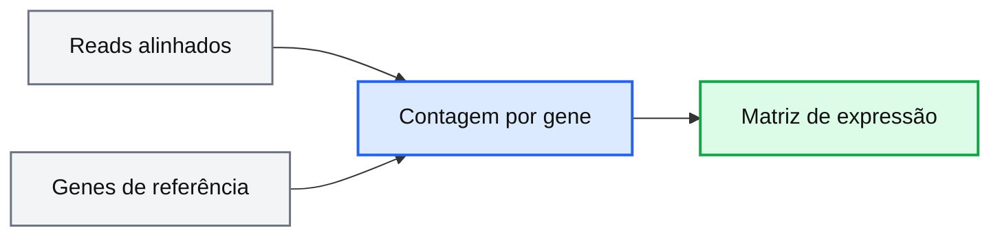

# Teoria

## O que é RNA-seq?

RNA-seq (RNA sequencing) é uma técnica utilizada para quantificar moléculas de RNA presentes em uma amostra biológica.

De forma simplificada, o RNA extraído das células é convertido em uma biblioteca de DNA complementar (cDNA), sequenciado, e posteriormente analisado computacionalmente.

A quantidade de reads associadas a um gene pode ser utilizada como uma estimativa de sua expressão gênica.

<div align="center">

</div>

<p align="center">
<em>Figura 1. Visão geral de técnica de RNA-seq. (Template do BioRender)</em>
</p>

---

## Perguntas biológicas comuns

RNA-seq pode ser utilizado para investigar:

- genes diferencialmente expressos entre condições
- resposta celular a tratamentos
- diferenças entre tecidos ou tipos celulares
- programas regulatórios e vias moleculares

---

## Desenho experimental

O desenho experimental é uma das etapas mais importantes de um experimento de RNA-seq.

Mesmo análises computacionais sofisticadas não conseguem compensar problemas no planejamento experimental.

### Conceitos importantes

- réplicas biológicas
- controles experimentais
- batch effects
- profundidade de sequenciamento
- randomização

### Exemplo

| Bom desenho experimental | Desenho problemático |
|---|---|
| múltiplas réplicas biológicas | apenas uma amostra por grupo |
| batches balanceados | grupos processados separadamente |
| controles adequados | ausência de controle |

<div align="center">

</div>

<p align="center">
<em>Figura 2. Efeitor confundidor entre técnica e biologia. (Fonte: https://www.biorxiv.org/content/10.1101/025528v1)</em>
</p>

---

## Visão geral do workflow de RNA-seq

Um experimento típico de RNA-seq envolve várias etapas computacionais.

### Fluxo geral

<div align="center">

</div>

<p align="center">
<em>Figura 3. Visão geral de um workflow típico de RNA-seq.</em>
</p>

---

## Reads e arquivos FASTQ

O sequenciamento gera arquivos FASTQ contendo reads de RNA.

Cada read possui:

| Linha | Descrição |
|---|---|
| 1 | Identificador do read: sempre começa com @ |
| 2 | Sequência do read |
| 3 | Sempre começa com +: pode ou não ter o nome do read |
| 4 | Score de qualidade de cada nucleotídeo do read |

Exemplo:

```text
@HWI-ST330:304:H045HADXX:1:1101:1111:61397
CACTTGTAAGGGCAGGCCCCCTTCACCCTCCCGCTCCTGGGGGANNNNNNNNNNANNNCGAGGCCCTGGGGTAGAGGGNNNNNNNNNNNNNNGATCTTGG
+
@?@DDDDDDHHH?GH:?FCBGGB@C?DBEGIIIIAEF;FCGGI#########################################################
```

```text
 Código de qualidade: !"#$%&'()*+,-./0123456789:;<=>?@ABCDEFGHI
                      |         |         |         |         |
  Score de qualidade: 0........10........20........30........40   
```

---

## Controle de qualidade

Antes da análise, é importante avaliar a qualidade dos dados de sequenciamento.

Ferramentas comuns incluem:

- FastQC
- MultiQC

### Por que controle de qualidade é importante?

Reads de baixa qualidade podem:

- mapear incorretamente
- reduzir eficiência de alinhamento
- gerar falsos positivos
- aumentar ruído experimental

<div align="center">

</div>

<p align="center">
<em>Figura 4. Exemplo de qualidade do fastq.</em>
</p>

## Métricas avaliadas

### Qualidade por base

Uma das métricas mais importantes é a qualidade média ao longo dos ciclos de sequenciamento.

Em geral:

- reads tendem a perder qualidade no final
- regiões de baixa qualidade podem ser removidas durante trimming

### Conteúdo GC

Avalia a distribuição de conteúdo GC nos reads.

Desvios inesperados podem indicar:

- contaminação
- viés de biblioteca
- composição incomum da amostra

### Sequências adaptadoras

Durante o preparo da biblioteca, adaptadores são adicionados às moléculas.

Quando fragmentos muito curtos são sequenciados, partes desses adaptadores podem aparecer nos reads.

Isso pode:

- prejudicar alinhamento
- afetar quantificação
- aumentar ruído técnico

Ferramentas de trimming removem essas sequências antes da análise.

## Trimming e filtragem

Após QC, reads podem passar por:

- remoção de adaptadores
- remoção de bases de baixa qualidade
- filtragem de reads curtos

Ferramentas comuns incluem:

- Trim Galore
- fastp
- Cutadapt

---

## Alinhamento e pseudoalinhamento

Após o controle de qualidade, os reads precisam ser associados a genes ou transcritos de referência.

Essa etapa permite identificar:

- de qual gene um read provavelmente se originou
quais genes estão sendo expressos
- a abundância relativa de cada transcrito

### Ferramentas comuns

| Estratégia | Ferramentas |
|---|---|
| alinhamento | STAR, HISAT2 |
| pseudoalinhamento | Salmon, Kallisto |
	
### Genoma de referência

Representa a sequência completa de DNA de um organismo.

Inclui:

- éxons
- íntrons
- regiões intergênicas
- cromossomos

### Transcriptoma

Representa apenas as sequências transcritas esperadas.

Inclui:

- genes expressos
- isoformas
- transcritos anotados

### Alinhamento tradicional

No alinhamento tradicional, cada read é mapeado diretamente ao genoma de referência.

O algoritmo tenta determinar:

- posição exata do read
- mismatches
- gaps
- splice junctions

### Arquivos BAM

Após o alinhamento, os reads são armazenados em arquivos BAM contendo:

- posição genômica
- orientação
- qualidade do alinhamento
- informações de pareamento

<div align="center">

</div>

<p align="center">
<em>Figura 5. Alinhamento de reads no genoma de referência. Fonte: https://www.nature.com/articles/nbt0510-421</em>
</p>

### Pseudoalinhamento

No pseudoalinhamento, os reads não são alinhados base a base ao genoma.

Em vez disso, o algoritmo identifica rapidamente quais transcritos são compatíveis com cada read.


| Característica | Alinhamento          | Pseudoalinhamento    |
| -------------- | -------------------- | -------------------- |
| velocidade     | menor                | maior                |
| uso de memória | maior                | menor                |
| detalhamento   | alto                 | moderado             |
| geração de BAM | sim                  | geralmente não       |
| ideal para     | análises estruturais | quantificação rápida |

<div align="center">

</div>

<p align="center">
<em>Figura 6. Pseudoalinhamento de reads no transcriptoma de referência. Fonte: https://www.nature.com/articles/nbt.3519</em>
</p>

---

## Quantificação de expressão gênica

Após o alinhamento, os reads são quantificados para gerar uma matriz de expressão gênica.

### Como a quantificação funciona?

De forma simplificada, a quantificação consiste em contar quantos reads foram associados a cada gene.

Genes mais expressos tendem a gerar:

- mais moléculas de RNA
- mais fragmentos durante o preparo da biblioteca
- mais reads no sequenciamento

### Da sequência para a matriz de expressão

Durante essa etapa:



Cada gene recebe um valor correspondente ao número de reads observados naquela amostra.

### Estrutura típica da matriz

| Gene | Sample_1 | Sample_2 |
|---|---|---|
| GeneA | 120 | 95 |
| GeneB | 540 | 620 |

Nessa matriz:

- linhas representam genes
- colunas representam amostras
- valores representam abundância de reads

Essa matriz é a principal entrada para análises downstream como:

- PCA
- clustering
- expressão diferencial
- enriquecimento funcional

### Contagens brutas não são diretamente comparáveis

O número absoluto de reads depende de fatores técnicos como:

- profundidade de sequenciamento
- tamanho da biblioteca
- composição da amostra

Por isso, antes de comparar amostras, os dados precisam passar por etapas de normalização.

### Normalização

A normalização tenta corrigir diferenças técnicas entre amostras para permitir comparações biológicas mais confiáveis.

Exemplos de abordagens

| Método              | Objetivo                            |
| ------------------- | ----------------------------------- |
| CPM                 | corrigir profundidade               |
| TPM                 | normalizar tamanho gênico           |
| DESeq2 size factors | normalização robusta entre amostras |

### Genes altamente expressos dominam a biblioteca

Em RNA-seq, poucos genes muito expressos podem representar grande parte dos reads totais.

Isso pode afetar:

- comparação entre amostras
- detecção de genes pouco expressos
- interpretação biológica

Por isso, métodos estatísticos específicos são necessários para modelar os dados corretamente.

### Contagens representam estimativas

É importante lembrar que RNA-seq não mede moléculas diretamente.

As contagens observadas são influenciadas por:

- eficiência de extração
- preparo de biblioteca
- PCR
- viés de sequenciamento
- alinhamento

Assim, os valores obtidos representam estimativas da abundância relativa de RNA.

---

## Limitações de RNA-seq

Embora RNA-seq seja uma técnica poderosa, existem limitações importantes.

### Algumas limitações incluem:

- RNA não corresponde necessariamente à abundância proteica
- batch effects podem influenciar resultados
- populações celulares heterogêneas podem mascarar sinais biológicos
- resultados dependem fortemente do desenho experimental
